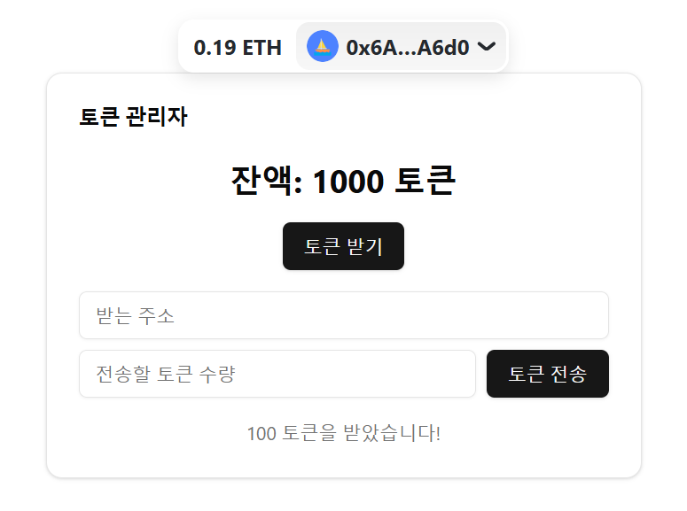
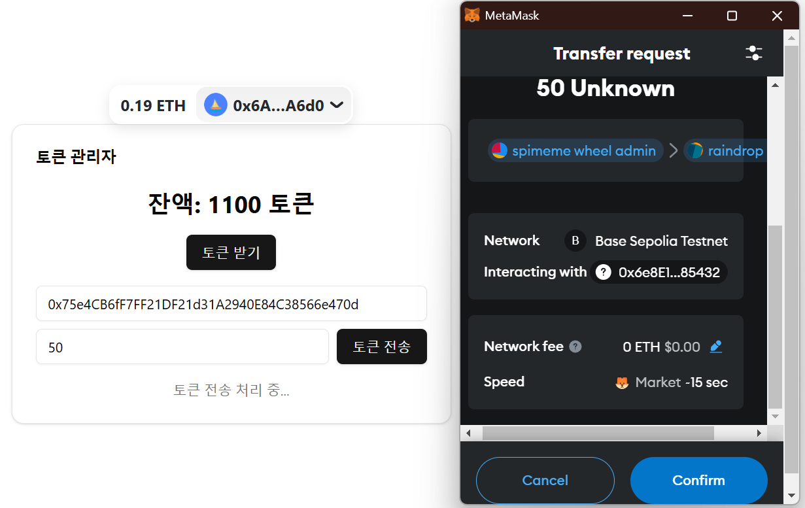
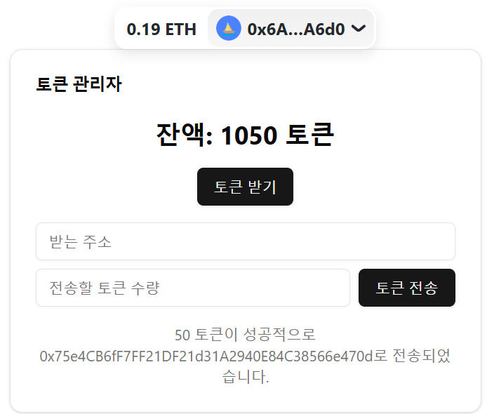

# raindrop tree
목마를 때 물방울을 한방울 씩. 또옥 💧







# 기능
- faucet: 일정 시간마다 토큰 받기
- transfer: 토큰을 다른 지갑으로 전송하기


# 빌드 방법
1. dependencies 다운로드 하기
```sh
npm install
```

2. .env 파일 생성하기 (미리 작성된 env를 사용하면, 바로 사용할 수 있습니다)
```env
# testnet
BASE_SEPOLIA_RPC_URL=https://sepolia.base.org
ADMIN_PRIVATE_KEY=0xf8a4c9987760efc64c8862c7dbf770b4b3d73833573528e747c8cdade29d9313

NEXT_PUBLIC_TOKEN_CONTRACT_NAME="Drop"
NEXT_PUBLIC_TOKEN_CONTRACT_ADDRESS=0x6e8E1d5cbfec309a802A651a9993888efcb85432
NEXT_PUBLIC_ADMIN_WALLET_ADDRESS=0x75e4CB6fF7FF21DF21d31A2940E84C38566e470d
```

3. 서버 시작하기
**프론트**  
```sh
npm run dev
```

**백엔드**  
```sh
npx nodemon ./src/server.js
```

4. 브라우저로 [localhost:3000](https://localhost:3000) 접속하기

> [!NOTE]  
> - 네트워크: [sepolia base](https://docs.base.org/docs/network-information/#base-testnet-sepolia)
> - 만약 sepolita ether가 부족하면 [chainlink faucet](https://faucets.chain.link/base-sepolia)에서 받을 수 있습니다.


> [!NOTE]  
> 만약 Token contract를 새로 배포하려면 아래 단계를 따라해주세요.
<details>
<summary>단계 보기 (클릭해서 펼치기)</summary>

1. contracts/Drop.sol ERC20 토큰 이름 바꾸기

2. 컴파일 하기
```sh
npx hardhat copile
```

3. .env 파일 설정하기

4. contract 배포하기
```
npx hardhat run scripts/token_deploy.js --network sepoliaBase
```
배포된 contrct 주소 .env파일에 넣기

5. 서버 실행하기

- 위 hardhat 빌드 과정은 모두 foundry로도 가능합니다.
</details>


# 사용 라이브러리
- [RainbowKit](https://rainbowkit.com)
- [wagmi](https://wagmi.sh)
- [Next.js](https://nextjs.org/)
- [Hardhat](https://hardhat.org/)

# LICENSE
[MIT](LICENSE)

